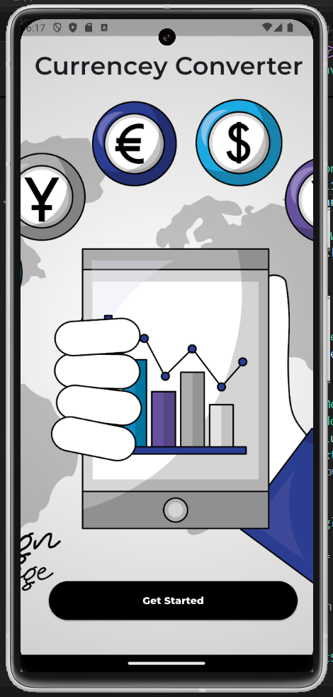
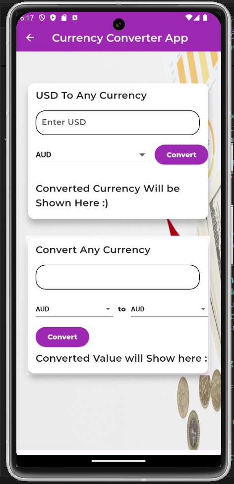
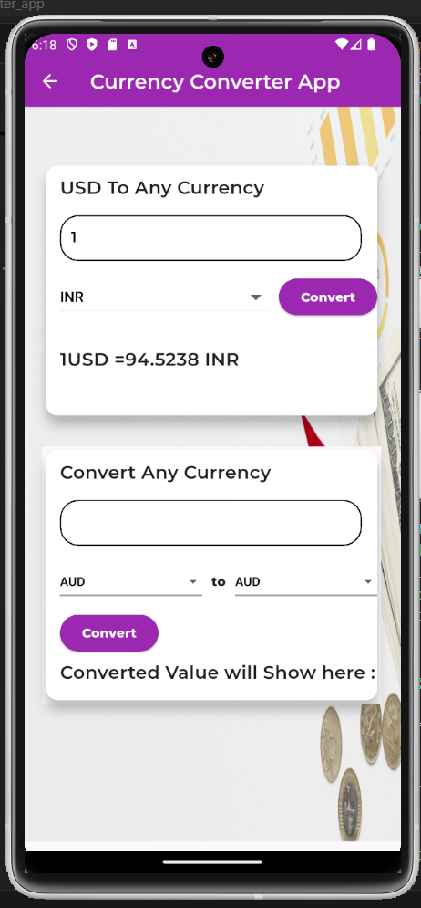
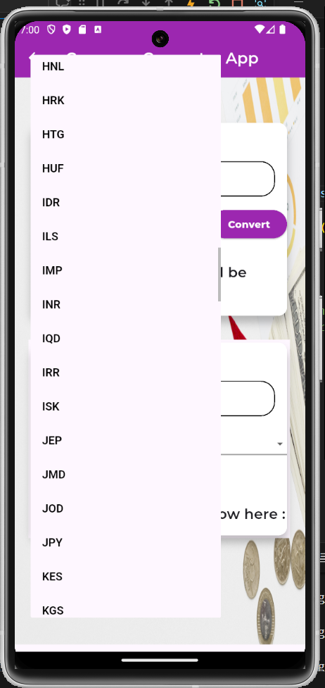
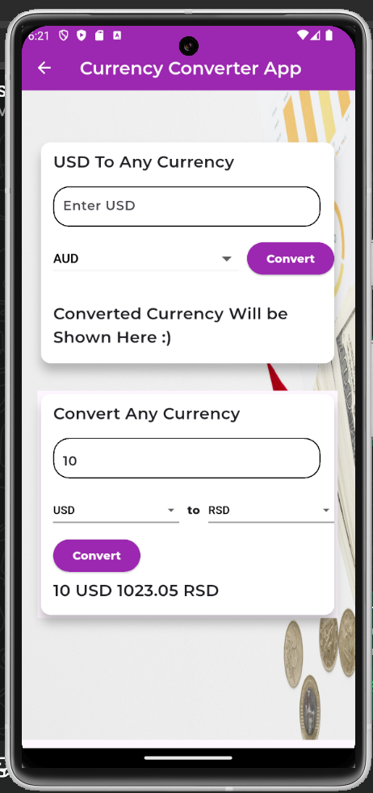

# 💱 Currency Converter App

A Flutter-based Currency Converter application that allows users to perform real-time currency conversions using live exchange rates from the Open Exchange Rates API.

The app supports both **USD to Any Currency** conversion and **Any Currency to Any Currency** conversion, providing users with accurate and up-to-date exchange rates. Exchange rate data is fetched from the Open Exchange Rates API and parsed using models generated through QuickType, making data handling clean and efficient.

---

## 🚀 Features

* Convert USD to any supported currency.
* Convert any currency to any other currency.
* Real-time exchange rates using Open Exchange Rates API.
* Dynamic currency selection through dropdown menus.
* Clean and beginner-friendly Flutter UI.
* Environment variable support using `.env` for API key security.
* JSON model generation using QuickType.
* Responsive and easy-to-use interface.

---

## 🛠️ Tech Stack

* Flutter
* Dart
* Open Exchange Rates API
* HTTP Package
* Flutter Dotenv
* QuickType.io

---

## 📸 Screenshots

### Landing Screen

The initial screen displayed when the application launches. It provides a simple introduction to the app along with a **Get Started** button that navigates users to the main currency conversion interface.



---

### Home Screen

The main dashboard of the application containing two conversion modules:

1. **USD to Any Currency**
2. **Any Currency to Any Currency**

Both modules use live exchange rates fetched from the Open Exchange Rates API to ensure accurate conversions.



---

### USD to Any Currency Conversion

An example demonstrating the conversion of USD into INR using real-time exchange rates. Users can enter an amount in USD, select the target currency, and instantly view the converted value.



---

### Currency Selection Dropdown

Users can choose from a wide range of supported currencies through a dropdown menu. The list is dynamically populated using currency data fetched from the API.



---

### Any Currency to Any Currency Conversion

This feature allows users to convert between any two supported currencies. Users enter an amount, select the source currency, choose the target currency, and receive the converted value based on the latest exchange rates.



---

## 🔑 API Integration

This project uses the Open Exchange Rates API to retrieve live exchange rate data.

Exchange rates are fetched using asynchronous HTTP requests and mapped into Dart models generated with QuickType.

Example endpoint:

```text
https://openexchangerates.org/api/latest.json
```

---


## ⚙️ Installation

1. Clone the repository

```bash
git clone <repository-url>
```

2. Navigate to the project directory

```bash
cd currency_converter_app
```

3. Install dependencies

```bash
flutter pub get
```

4. Create a `.env` file in the root directory

```env
API_KEY=YOUR_OPEN_EXCHANGE_RATES_API_KEY
```

5. Run the application

```bash
flutter run
```

---

## 📚 What I Learned

While building this project, I gained hands-on experience with:

* REST API integration in Flutter
* Working with asynchronous programming using Future and async/await
* Parsing JSON data into Dart models
* Using FutureBuilder for API-driven UI updates
* Managing sensitive API keys using environment variables
* Creating reusable Flutter widgets
* Building dynamic dropdown-based interfaces

---

## 🔮 Future Improvements

* Currency search functionality
* Favorite currencies
* Exchange rate history
* Currency conversion charts
* Improved UI/UX and animations
* Offline caching of exchange rates

---

## 👨‍💻 Author

Developed as part of my Flutter learning journey to strengthen skills in API integration, asynchronous programming, and state management.
